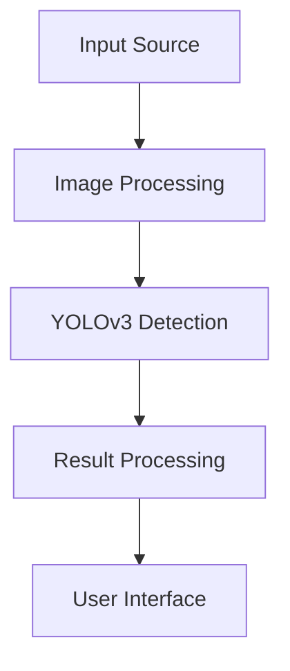

# SmartEye 👁️

Real-Time Object Detection System using YOLOv3 and Flutter

## 🚀 Overview

SmartEye is an advanced real-time object detection system that leverages the power of YOLOv3 algorithm and Flutter framework to provide accurate and efficient object detection capabilities. Whether you're using live camera feed, video, or static images, SmartEye delivers instant results with high precision.

## ✨ Features

- **Real-time Detection**: Instant object detection using YOLOv3 algorithm
- **Multiple Input Sources**:
  - 📸 Live Camera Feed
  - 🎥 Video Processing
  - 🖼️ Static Image Analysis
- **Cross-Platform**: Built with Flutter for seamless performance across different devices
- **User-Friendly Interface**: Intuitive design for easy navigation and operation
- **High Performance**: Optimized for low latency and high accuracy

## 🛠️ Technical Requirements

### Software Requirements
- Flutter SDK
- YOLOv3 Libraries
- OpenCV for image processing
- Mobile device with compatible OS

### Hardware Requirements
- Smartphone with:
  - Compatible camera
  - Sufficient processing power for real-time detection
  - Adequate storage space for the application

## 🎯 System Architecture

## 👥 Team Members

- Zulkifli (2022573010057)
- Muhammad Alfata (2022573010094)
- Muhammad Rasyid Wanandi (2022573010104)
- Fachri Yumanda Putra (2022573010089)

## 🏛️ Institution
Politeknik Negeri Lhokseumawe - Information Technology Department

## 📱 Interface Preview

### Main Features:
- **Home Screen**: Quick access buttons for different input sources
- **Settings Page**: Customizable detection parameters
- **Results Page**: Detailed view of detected objects
- **Live Detection**: Real-time object tracking with visual feedback

## 🔄 System Flow

1. **Input Selection**: Choose between camera, video, or image input
2. **Processing**: Real-time image processing using YOLOv3
3. **Detection**: Object identification and tracking
4. **Display**: Visual feedback with bounding boxes and labels
5. **Results**: Detailed information about detected objects

## 📊 Performance

- High accuracy in object detection
- Low latency for real-time processing
- Optimized resource usage
- Smooth user experience

## 🔜 Future Enhancements

- Additional object detection models
- Enhanced tracking capabilities
- Extended database integration
- Advanced analytics features

## 📄 License

This project is developed as part of an academic requirement at Politeknik Negeri Lhokseumawe.

---
*Last Updated: October 14, 2024*